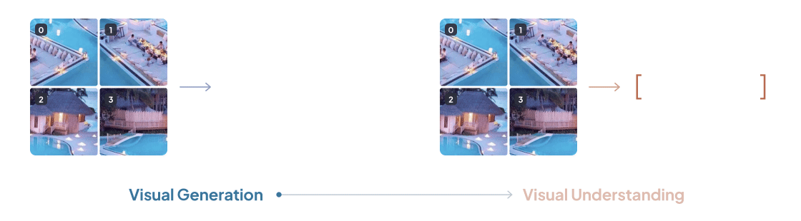
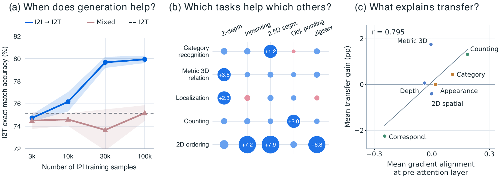
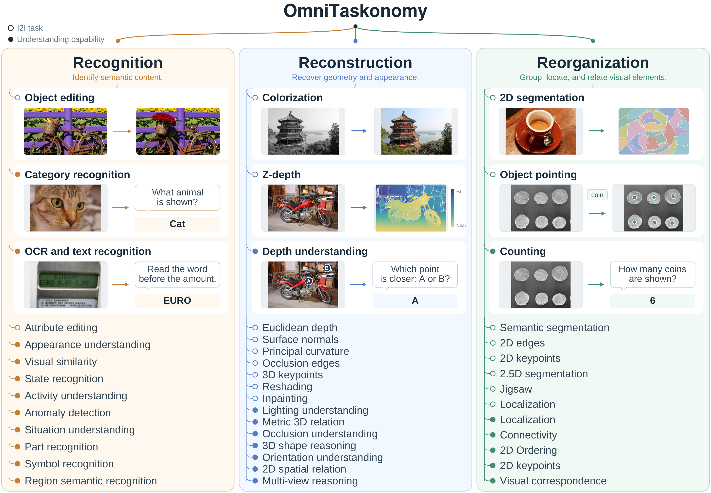

<h1 align="center">OmniTaskonomy: When Does Visual Generation<br>Improve Visual Understanding?</h1>

<p align="center">
<a href="https://gejiaxin.org/">Jiaxin Ge</a><sup>1*</sup> &nbsp; <a href="https://wakals.github.io/">Yiming Qin</a><sup>2,6*</sup> &nbsp; <a href="https://horizonwind2004.github.io/">Ji Xie</a><sup>3</sup> &nbsp; <a href="https://astro-eric.github.io/">Haozhe Jiang</a><sup>1</sup> &nbsp; <a href="https://xhan77.github.io/">Xiaochuang Han</a><sup>4</sup><br>
<a href="https://www.junyi42.com/">Junyi Zhang</a><sup>1</sup> &nbsp; <a href="https://github.com/a-dai">Andrew Dai</a><sup>5</sup> &nbsp; <a href="https://sites.google.com/site/yinfeiyang">Yinfei Yang</a><sup>5</sup> &nbsp; <a href="https://people.eecs.berkeley.edu/~malik/">Jitendra Malik</a><sup>1</sup> &nbsp; <a href="https://ranjaykrishna.com/">Ranjay Krishna</a><sup>4</sup> &nbsp; <a href="https://www.sewonmin.com/">Sewon Min</a><sup>1</sup><br>
<a href="https://havenfeng.github.io/">Haiwen Feng</a><sup>1,6†</sup> &nbsp; <a href="https://www.salesforce.com/blog/author/le-xue/">Le Xue</a><sup>5†</sup> &nbsp; <a href="https://bfshi.github.io/">Baifeng Shi</a><sup>1†</sup> &nbsp; <a href="https://people.eecs.berkeley.edu/~trevor/">Trevor Darrell</a><sup>1†</sup> &nbsp; <a href="https://xudongfrankwang.github.io/">XuDong Wang</a><sup>1,2†</sup>
</p>

<p align="center">
<sup>1</sup>University of California, Berkeley &nbsp; <sup>2</sup>Duke University &nbsp; <sup>3</sup>Carnegie Mellon University<br>
<sup>4</sup>University of Washington &nbsp; <sup>5</sup>Elorian &nbsp; <sup>6</sup>Impossible Research
</p>

<p align="center">
<sup>*</sup> Equal contribution &nbsp;&nbsp; <sup>†</sup> Equal advising
</p>

<p align="center">
  <a href="https://omni-taskonomy.github.io/"></a>
  <a href="https://arxiv.org/abs/2609.38079"></a>
  <a href="https://huggingface.co/datasets/Wakals/OmniTaskonomy"></a>
</p>

<p align="center">
  
</p>
<p align="center">
  <a href="#overview">Overview</a> &bull;
  <a href="#key-findings">Key Findings</a> &bull;
  <a href="#the-omnitaskonomy-taxonomy">Taxonomy</a> &bull;
  <a href="#quick-start">Quick Start</a> &bull;
  <a href="#repository-layout">Repository Layout</a> &bull;
  <a href="#citation">Citation</a>
</p>

## Overview

Unified multimodal models (UMMs) are trained both to generate images and to understand them. OmniTaskonomy studies **when visual generation improves visual understanding**, by pairing image-to-image (I2I) generation tasks with image-to-text (I2T) understanding capabilities and measuring how training on one transfers to the other.

We ask three questions:

| | Question | How we study it |
| :---: | --- | --- |
| **Q1** | What training curriculum enables visual generation to improve visual understanding? | Six training recipes on paired I2I/I2T tasks that solve the same problem from the same input and differ only in the output modality. |
| **Q2** | Which visual generation tasks help which understanding tasks? | A transfer matrix from 19 I2I tasks to understanding capabilities, evaluated on 9,444 annotated samples. |
| **Q3** | What explains the success or failure of transfer? | Gradient alignment between the I2I and I2T objectives, by module, by layer, and across source–target pairs. |

This repository contains the code for all three: training, benchmark evaluation, transfer-matrix analysis, and gradient analysis, with [BAGEL](https://github.com/bytedance-seed/BAGEL) as the reference model and an adapter interface for [testing your own UMM](#test-your-own-umm).

## Key Findings

<p align="center">
  
</p>

### Finding 1: An initial I2I training stage helps I2T learning

An initial I2I training stage that updates parameters shared with the I2T objective provides a useful initialization for subsequent I2T learning.

- **I2I → I2T** and **I2I → Mixed** scale consistently as the amount of I2I data increases.
- Freezing the shared weights during the I2I stage, or mixing the two objectives from the start, gives weaker or less stable gains.
- We use I2I → I2T as the default recipe in the remaining experiments.

<details>
<summary>The six training recipes</summary>

| Recipe | Schedule | Description |
| :---: | --- | --- |
| R1 | I2T only | Train only on I2T. |
| R2 | I2I → I2T | Train on I2I while updating the shared understanding weights, then finetune on I2T. |
| R3 | Mixed → I2T | Jointly train on I2I and I2T, then finetune on I2T. |
| R4 | Frozen I2I → Mixed | Train on I2I with the shared understanding weights frozen, then switch to mixed training. |
| R5 | Mixed | Jointly train on I2I and I2T throughout. |
| R6 | I2I → Mixed | Train on I2I while updating the shared understanding weights, then switch to mixed training. |

</details>

### Finding 2: Generation supervision improves specific understanding capabilities

Visual generation supervision yields significant gains for specific understanding capabilities, both within and across task families.

| I2I source | I2T capability | Gain (pp) |
| --- | --- | :---: |
| Localization | Counting | +2.5 |
| Object pointing | Counting | +2.0 |
| Euclidean depth | Metric 3D relation | +3.8 |
| Z-depth | Metric 3D relation | +3.6 |
| Surface normals | Metric 3D relation | +3.4 |
| Jigsaw | 2D ordering | +6.8 |
| Inpainting | 2D ordering | +7.2 |
| 2.5D segmentation | Category recognition | +1.2 |

### Finding 3: Gradient alignment is associated with transfer

Gradient alignment between the I2I and I2T objectives is concentrated in **early pre-attention normalization layers** and is positively associated with downstream transfer.

- Across understanding capabilities, mean alignment and mean transfer correlate at **r = 0.795**.
- Across all 133 individual source–target pairs, they correlate at **r = 0.529**.

See the [project page](https://omni-taskonomy.github.io/) for the full transfer matrix and interactive plots.

## The OmniTaskonomy Taxonomy

OmniTaskonomy organizes **19 generation tasks** and **25 understanding capabilities** into a shared hierarchy with three families: Recognition, Reconstruction, and Reorganization.

<p align="center">
  
</p>

| Family | What it covers | I2I tasks | I2T capabilities |
| --- | --- | :---: | :---: |
| **Recognition** | Identifying semantic content | 2 | 11 |
| **Reconstruction** | Recovering geometry and appearance | 9 | 8 |
| **Reorganization** | Grouping, locating, and relating visual elements | 8 | 6 |

Each benchmark sample is assigned to one understanding capability by three independent VLM judges. A sample is retained when at least two judges agree, which yields **9,444 evaluation samples**.

The data is hosted on Hugging Face:

| Dataset | Contents |
| --- | --- |
| [Wakals/OmniTaskonomy](https://huggingface.co/datasets/Wakals/OmniTaskonomy) | 9,444 I2T evaluation samples across 25 capabilities, and 350,000 I2I training samples across seven transfer sources. |
| [Wakals/OmniTaskonomy_Recipe_Data](https://huggingface.co/datasets/Wakals/OmniTaskonomy_Recipe_Data) | Six paired I2I/I2T subsets for the training-recipe experiments. |

## Quick Start

### 1. Set up the environment

Our experiments are conducted on Linux with conda and a CUDA toolkit compatible with PyTorch 2.5.1.

```bash
conda create -n omnitaskonomy python=3.10 -y
conda activate omnitaskonomy
bash scripts/install.sh
export LMUData="$PWD/data/raw/benchmarks"
export OMNI_MODEL="$PWD/checkpoints/BAGEL-7B-MoT"
```

| Variable | Purpose |
| --- | --- |
| `LMUData` | Where benchmark data is stored. |
| `OMNI_MODEL` | Where the BAGEL weights are stored. |

All commands accept `--help`. BAGEL training defaults to four GPUs.

### 2. Choose a workflow

#### Reproduce the BAGEL baseline

Follow the [BAGEL guide](docs/reproduce_bagel.md). It covers each stage in order:

| Stage | Entry point |
| --- | --- |
| Download model weights | `scripts/download_model.py` |
| Prepare data | `scripts/prepare_taskonomy.py`, `scripts/prepare_transfer.py`, `scripts/prepare_recipe.py` |
| Train | `scripts/run_experiment.py` |
| Evaluate on OmniTaskonomy | `scripts/evaluate_transfer.sh` |
| Build the transfer matrix | `scripts/collect_transfer_inputs.py`, `scripts/analyze_transfer.py` |
| Analyze gradients | `scripts/prepare_gradient_matrix.py`, `scripts/analyze_gradients.py` |

#### Test your own UMM

Follow the [custom UMM guide](docs/custom_umm.md) to write an adapter for your model and run the same training, evaluation, and gradient experiments.

## Repository Layout

```
OmniTaskonomy/
├── omnitaskonomy/   # Core package: training, evaluation, gradients, taxonomy, adapters
├── scripts/         # Command-line entry points
├── configs/         # Training, evaluation, experiment, and gradient configurations
├── data/            # Taxonomy definitions and gradient reference data
├── docs/            # Guides and figures
├── tests/           # Unit tests
├── Bagel/           # BAGEL model code
└── VLMEvalKit/      # Evaluation framework
```

## Citation

If you find OmniTaskonomy useful, please cite:

```bibtex
@misc{ge2026omnitaskonomy,
  title  = {{OmniTaskonomy}: When Does Visual Generation Improve Visual Understanding?},
  author = {Ge, Jiaxin and Qin, Yiming and Xie, Ji and Jiang, Haozhe and Han, Xiaochuang and Zhang, Junyi and Dai, Andrew and Yang, Yinfei and Malik, Jitendra and Krishna, Ranjay and Min, Sewon and Feng, Haiwen and Xue, Le and Shi, Baifeng and Darrell, Trevor and Wang, XuDong},
  year   = {2026},
  url    = {https://omni-taskonomy.github.io/}
}
```

## License

| Component | License |
| --- | --- |
| Dataset | [Dataset licenses](https://huggingface.co/datasets/Wakals/OmniTaskonomy/blob/main/LICENSE.md) |
| Model | [BAGEL license](Bagel/LICENSE) |
| Evaluation framework | [VLMEvalKit license](VLMEvalKit/LICENSE) |

## Acknowledgements

We thank the authors of [BAGEL](https://github.com/bytedance-seed/BAGEL) and [VLMEvalKit](https://github.com/open-compass/VLMEvalKit) for open-sourcing their code.

## Contact

For questions or ideas, feel free to reach out to Jiaxin Ge ([gejiaxin01@gmail.com](mailto:gejiaxin01@gmail.com)) and Yiming Qin ([ymk4474@gmail.com](mailto:ymk4474@gmail.com)).
